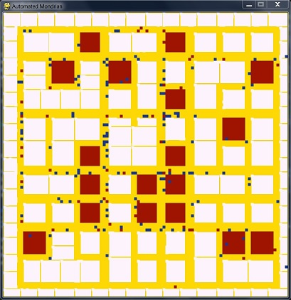

mondrian
========

Experiment with Artificial Societies and basic city generation. Visual inspired by Piet Mondrian's Broadway Boogie Woogie.

Cities are generated in a pseudo-random fashion from simple street patterns. Houses (white boxes) and markets (red boxes) are derived from streets (yellow). Each agent (or citizen) is allocated to a house, and moves randomly in the city. Agents increase their health finding food (i.e. in markets). 

A Floyd algorithm ensures real-time pathfinding to lead each agents through a graph automatically deduced from the city structure. During their motion, agents use also a simple avoidance technique based on neighborhood occupation.

Simulation parameters: {city size, number of citizens}

### Instructions
Install Python 2.6 and above: https://www.python.org.  
Install Pygame 1.9 package: http://www.pygame.org.  
On command schell, execute: `python mondrian.py`.  

### References
- Schelling, Thomas C. (1978). Micromotives and Macrobehavior. Norton.
- Batty, Michael (2005). Cities and Complexity, understanding Cities with Cellular Automata, Agent-Based Models, and Fractals. The MIT Press.
